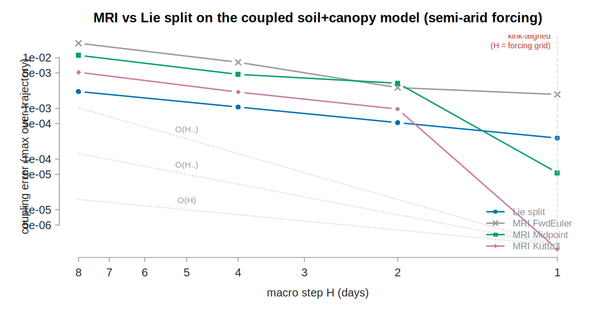
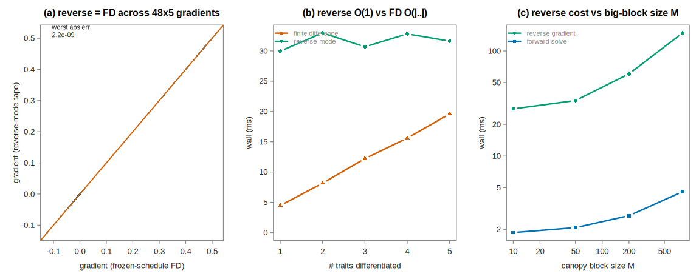

# TF24 multi-rate stepper — prescriptive implementation plan (MRI-GARK over odelia)

*Turns the multirate survey + the ARKODE MRIStep brief into a staged, prescriptive plan
for the odelia AD engine, and ships a validated forward-mode **draft** you can run today.
Grounded in [`ad-engine-surface-design.md`](./ad-engine-surface-design.md),
[`ad-record-replay.md`](./ad-record-replay.md), and the evidence in
[`tf24-rodas-multirate.md`](./tf24-rodas-multirate.md).*

Draft code + tests: [`scripts/tf24-multirate/`](../scripts/tf24-multirate/) —
`mri_core.hpp` (generic MRI macro step + tables), `test_mri.cpp` (collapse + order gate),
`multirate_runner.cpp::mri_run` (soil+canopy), `mri_soil_test.R` (MRI vs Lie split).

---

## 0. What is already true (measured in this repo)

Two prior results fix the design space and are not re-argued here:

- **RODAS does not help and does not scale.** The TF24 soil step-collapse is accuracy-
  (not stability-) limited — RK45 step count is flat across a 3000× stiffness sweep, 100 %
  accuracy-limited — so an implicit method cannot enlarge the steps; and *global* dense
  RODAS is O(N³), ~470× slower than RK45 at N=205. (`tf24-rodas-multirate.md`.)
- **Multi-rate is flat in the big-block size M** and ~1200× faster than global RODAS at
  N=205. (same.)

This plan makes the *how*. The forward draft is validated; the remainder is the reverse-mode
wiring, which the [`ad-engine-build-plan.md`](./ad-engine-build-plan.md) already scoped as
"mechanical, later" — this plan discharges that claim concretely.

## 1. Decisions locked

| decision | choice | why |
|---|---|---|
| family | **MRI-GARK**, solve-decoupled, explicit-slow, **component partition** | black-box fast IVP ≡ record→replay; order lives in data; the survey's recommended family |
| partition | slow = big smooth block (cohorts/canopy); fast = the ≤5 soil states; **static** | S1 — no auto-partitioning machinery |
| coupling table | data (`MRIStepCoupling` shape: `c`, `Γ^{(k)}` matrices, embedding, order) | order lives in tables; robustness in the inner |
| inner integrator | black-box adaptive stepper behind an `InnerStepper` seam (`MRIStepInnerStepper` shape) | swap explicit RK ↔ Rosenbrock/IFT ↔ exponential per regime, invisible to coupling order |
| macro grid | **the forcing-kink grid** (daily) | measured: high-order MRI only realizes its order when legs don't cross forcing kinks (§2) |
| new Layer-K nodes | **none** | scan, scalar-IFT, breakpoint, γ already cover it |

Explicitly rejected (survey + our measurements): global RODAS (O(N³)); MrGARK (substep ratio
M baked into coefficients — hostile to our 1→10³ variable episodes); extrapolation / multistep
/ QSS (kinks & events destroy them); the **desingularizing chart** (E2 measured every chart
*worse*, 0.30–0.47× steps — drop it, keep multirate + kink-split).

## 2. Draft results that gate this plan (measured, forward-mode double)

**Method-correctness gate** (`test_mri.cpp`, pure C++): the two collapse identities hold to
machine precision — `f^F≡0` reproduces the induced base ERK to **1e-16**, `f^S≡0` reproduces
the pure inner integrator to **1e-13** — and the empirical coupling order on a linear two-rate
system is **1 / 2 / 2 / 3** for FwdEuler / Midpoint / Heun / Kutta3, exactly as the tables
claim. (Collapse identities catch coefficient-convention errors that convergence tests miss.)

**Soil+canopy vs the Lie-split baseline** (`mri_soil_test.R`, M=100, semi-arid forcing, vs a
tight global reference):



At the **kink-aligned daily macro step (H = 1 day = the forcing grid)**:

| method | coupling error | soil sub-steps | wall | vs Lie |
|---|---:|---:|---:|---:|
| Lie split (Rung 0) | 2.6e-4 | 5562 | 7.5 ms | 1× |
| MRI Midpoint (order 2) | 5.4e-5 | 8070 | 10.8 ms | **5× more accurate** |
| MRI Kutta3 (order 3) | 1.7e-6 | 8068 | 10.8 ms | **156× more accurate** (at 1.44× cost) |

**The load-bearing caveat, measured:** when macro steps *cross* forcing kinks (H > 1), the
high-order slow-path reconstruction overshoots the discontinuity and MRI is *worse* than the
robust Lie split. High order is only realized with **kink-aligned macro steps (or leg-splitting
at kink times)** — direct quantitative support for the build plan's "split steps at recorded
forcing kinks" rule. This is a requirement, not a tuning knob.

## 3. Engine placement (layers M / N / K)

- **Layer M (model): untouched** — the payoff of the seam. A strategy still writes only
  scalar-generic pointwise closed forms + declarations. It gains one *passive declaration*:
  the stiff/fast index set (the ≤5 soil states) — already listed in the surface design's
  model surface ("the stiff index set (IMEX)").
- **Layer N (numerics): the new code.**
  - `MRIStepper<System>` — the macro driver (§4), templated on the scalar type `S`.
  - `MRICoupling` — the coupling-table struct (`c`, `Γ^{(k)}`, `q`, `p`), a registry of
    built-in tables, and **init-time numeric verification** (row sums = Δc, Σb = 1, induced
    order on a scalar test, both collapse identities). Copy `MRIStepCoupling`'s layout verbatim.
  - `InnerStepper` — the seam (`Evolve`, `FullRhs`, `Reset`, accumulated-error accessors).
    The existing evented/kink-split soil sub-cycler is refactored *behind* it. Copy
    `MRIStepInnerStepper`'s four-callback shape.
- **Layer K (tape kernels): nothing mandatory.** Optionally one fused "linear combination of
  stage vectors" node so the `Σ_k Γ P_k` contractions cost O(1) tape entries per vector, not
  O(N·K·s) scalar nodes. The scan, scalar-IFT, breakpoint, and γ nodes are unchanged.

This is the exact M/N/K split the surface design already commits to; MRI adds *orchestration*
in N, no new differentiated primitives in K.

## 4. The algorithm to implement (component partition), pinned

The draft (`mri_core.hpp::mri_macro_step`) is the reference. Production port = template on `S`
and replace the ad-hoc inner with the odelia `Solver` behind `InnerStepper`. One macro step
`[t, t+H]`, slow state `x`, fast state `u`, `F_j = f^S(z_j)`:

```
z ← y_n;  F_1 ← f^S(z)
for i = 2 … s+1:
  Δc = c_i − c_{i−1}
  if Δc = 0:  z_x += H Σ_{j<i} ā_ij F_{j,x}                      # instantaneous slow update
  else:
    # slow block follows its EXACT within-leg polynomial path (never sub-stepped):
    x̄_leg(τ) = agg(z_x) + H Σ_k [Σ_{j<i} Γ^{(k)}_ij F̄_j] τ^{k+1}/(k+1)   # aggregate, not state
    z_u ← InnerEvolve(z_u, x̄_leg(·), [t+c_{i−1}H, t+c_i H])      # black-box fast IVP, no forcing term
    z_x += H Σ_{j<i} ā_ij F_{j,x}                                # x_leg(1)
  if i ≤ s:  F_i ← f^S(z_x, z_u)                                 # slow reads u AT the abscissa
y_{n+1} = z_{s+1}
```

`ā_ij = Σ_k Γ^{(k)}_ij/(k+1)`. The fast IVP carries **no explicit forcing** (u-rows of `F_j`
are zero); the slow influence enters only through the aggregate `x̄_leg(τ)` the inner reads —
which is where the low-rank rule (§5) pays. Built-in tables in the draft: FwdEuler (K=0, order
1), Midpoint2/Heun2 (K=0, order 2), Kutta3 (order 3), each a row-difference MIS lift of a base
ERK, self-verified by the collapse identities. Production adds MIS-KW3 and MRI-GARK-ERK33a/45a
transcribed from ARKODE and **diff-tested against MRIStep** (fixed step, matched tableau, ~1e-13).

## 5. Reverse mode — the two-level record→replay (the payoff)

The transient gradient is the whole point, and it needs **no new adjoint theory** — the tape of
the scheme-as-run *is* the discrete adjoint. Extend the existing single-level
[record→replay](./ad-record-replay.md) to two levels:

- **Two-level frozen schedule.** Pass 1 records, per macro step, `{H, stage pattern}` and per
  leg `{micro sizes, kink splits, event brackets, inner-method switches, fit sample nodes}`;
  pass 2 replays both; the frozen-schedule FD reference injects both. This is exactly the build
  plan's "one cross-track contract," now concrete. The nested micro schedule is an L1-inside-L2
  recording — the primitive is *telescopic*, so this is record→replay applied recursively, not a
  new mechanism.
- **The low-rank aggregate rule = the scan primitive (already built).** Never let the fast loop
  read the slow **state's** dense output (`O(N·s)` per micro read → ~10⁶ tape entries/macro).
  Build the **aggregate's** dense output once per macro step (`O(N·s)`, the scan), interpolate
  the r≤handful coupling scalars in the fast loop (`O(r)` per read), and keep an r×s adjoint
  accumulator the macro reverse pass injects into the stage adjoints. The draft already passes
  only the scalar aggregate polynomial to the inner — this rule is structural, not optional.
- **Events stay active.** Freeze the micro *grid*, but keep each `u_min` touchdown/release
  substep length an **active scalar-IFT root** of the dense-output crossing (the breakpoint
  node you already have; transversality asserted). Do **not** freeze event *times* with the
  schedule — the F2 depletion-timing sensitivity is O(1) physics, and this carries the
  `[f]·dt*/dθ` term exactly. The embedding's re-integrated leg is pass-1-only and never taped.
- **Checkpoint arithmetic.** Canonical state at macro boundaries only (`O(N)` each). Because
  L ≤ 5, store *every* micro state in pass 1 (kilobytes) → pass-2 re-record is pure RHS
  re-evaluation: no inner Newton, no controller, no divergence risk.
- **Inner tolerance is part of the gradient's error budget.** Values tolerate a loose inner
  tol (ρ's error is second-order in the residual); gradients through the non-stationary σ
  channel are **first-order** in it. Use an H-Tol-style controller (inner tol tied to macro
  order) and set it tighter for gradients than for values — the surface design's "inner
  tolerance set for σ, not ρ," made operational.

## 6. The one genuinely open decision — the x→u aggregate's u-dependence

In the draft the fast block reads a **pure-τ** slow aggregate (`x̄ = mean(canopy)`), so the
loop closes trivially. In the real model the aggregate `a(x,u) = Σ_i σ_i(…)` is O(N) member
operating-point solves *and* depends on the fast unknown `u`. Recommendation:

- **Adopt option (1): a leg-local affine-in-u surrogate** `â(τ,u) = â₀(τ) + J_a(τ)·(u − u_ref(τ))`,
  the r coupling scalars fitted from a few O(N) sweeps per leg, `∂a/∂u` assembled from the
  member-level IFT partials the engine already computes; acceptance-check the fit residual at
  leg end (pass 1, `decide()`); the fit is taped arithmetic, so the adjoint is exact for the
  scheme-as-run.
- **Keep option (2) (exact per-micro-eval, warm-started) as a per-episode auditor** on sampled
  episodes, not the production path (it partially reinstates the N/L amplifier during episodes).
- **Reject option (3) (freeze a's u-argument at leg start):** first-order in exactly the
  deep-depletion regime where `∂σ/∂u` is largest — our physics.

Surrogate degree ≥ K+1 with an acceptance residual, or coupling order silently degrades below
the table order.

## 7. Validation ladder (prescriptive, cheapest first)

| stage | test | draft status |
|---|---|---|
| **V0** | table checks (row sums, induced order) + both collapse identities, values **and** adjoints | values ✅ (`test_mri.cpp`); adjoints TODO |
| **V1** | KPR replica: order sweep vs **ARKODE MRIStep** as oracle (fixed step, matched tableau) | linear-gate order ✅; add KPR + ARKODE diff-test |
| **V2** | taped adjoint vs frozen-two-level FD on KPR; **gradient-vs-inner-tol sweep** across an episode incl. a touchdown | TODO (Phase B) |
| **V3** | soil model: conservation/moment invariants; E4 trajectory vs Lie split; frozen-schedule gradient check with a θ that shifts episode timing (F2) | trajectory vs Lie ✅; gradient TODO |

KPR is tiny with a closed-form solution, so its FD references are free — it is the rehearsal
vehicle for the taped adjoint before touching the model.

## 8. Footguns, each locked as a standing test

- Can't reuse the current RK45 tableau (lift-the-coefficients → order 1). Adopt a published MRI
  table; documented change of the slow discretization.
- `1/Δc` normalization convention → the collapse-to-base-ERK test is the detector (run per table).
- `Δc = 0` stages are updates, not zero-length solves (don't launch an inner solve).
- Embedded error measures **slow** error only; budget **fast** error through the inner tol
  (aligns with E1 — the macro norm is an `x`-norm).
- Two clocks: forcing/kinks in absolute `t`, forcing polynomials in normalized `τ`; split micro
  steps at kink times **in t** (the draft reads rain in `t`, `x̄` in `τ`).
- No FSAL across the macro step; `Reset` the inner after a Δc=0 update or an event switch.
- Micro-tape volume: never hold more than one leg's micro tape live.
- Invariants (Σm conservation, moment identities) run against the MRI scheme — the aggregate
  surrogate is a new approximation the harness must certify.

## 9. Sequence

- **Phase A — forward, production (now).** Promote `mri_core` to `Layer-N MRIStepper<System>`;
  wrap the evented soil sub-cycler behind `InnerStepper`; table registry (FwdEuler, Midpoint2,
  MIS-KW3, ERK33a) with init-time verification; **macro grid = daily forcing grid**. Gate:
  V0(values) + V1 + V3(trajectory). *Deliverable already ~80 % in the draft.*
- **Phase B — reverse.** Two-level record→replay; aggregate surrogate (option 1); event-as-IFT;
  H-Tol inner controller. Gate: V0(adjoints) + V2 + V3(gradient/F2).
- **Phase C — tables/IMEX.** Adopt ERK33a/ERK45a (ARKODE diff-tested); add an implicit inner
  (Rosenbrock/IFT on the 5×5 block) **only if** the inner ever stability-binds
  (`h_inner·|∂f_u/∂u|` monitor) — insurance we measured we likely won't need.

## 10. Scope note

This is the **transient** regime only. The fixed-point / regnans gradients (the largest R7
payoff) are the Eulerian-BVP + IFT-adjoint layer and do not use the stepper at all — MRI cuts
the transient march cost (the N/L amplifier) and is orthogonal to the equilibrium gradients.

---

## 11. Phase B prototype — reverse-mode results (measured)

Reverse-mode AD is implemented through the multirate MRI scheme
([`mri_ad.hpp`](../scripts/tf24-multirate/mri_ad.hpp),
[`mri_ad_runner.cpp`](../scripts/tf24-multirate/mri_ad_runner.cpp)): a double adaptive pass
records the two-level frozen schedule (per-leg micro step sizes); an XAD reverse pass
(`AReal<double>`, `computeJacobian`) replays it **fixed-step**, taping the scheme-as-run; one
adjoint sweep returns `d(functional)/d(traits)`. The surrogate is the two-way low-rank
soil(5)+canopy(M) system with a 5-trait vector `{Ksat_mult, n_psi, t_pot, theta_wilt,
alpha_scale}`; **TF24f's tracked-`q` is just one more slow tracked state — same machinery, O(1)
more tape** (the canopy states are already tracked ODE states, so the surrogate exercises the
TF24f shape). Validation: [`mri_ad_test.R`](../scripts/tf24-multirate/mri_ad_test.R).



1. **The tape is the exact discrete adjoint.** Across **4 rainfall scenarios** (dry 29 / normal
   315 / wet 599 / pulsy 121 mm·yr⁻¹) **× 12 sampled trait vectors = 48 gradients** (5 components
   each), reverse-mode matches frozen-schedule central FD to a **worst absolute error of 2e-9**
   (the FD noise floor) — with hard positivity clamps *and* with smooth floors. No bespoke
   multirate adjoint; the tape of the scheme-as-run is the gradient (panel a).
2. **Reverse is O(1) in |θ|.** One sweep returns all trait gradients: reverse wall is **flat
   (~30 ms)** as the number of differentiated traits goes 1→5, while FD is **linear**
   (4.5→20 ms = 2|θ| forwards). Crossover ~7–8 traits; at the plant trait count (k≈17) reverse
   wins ~2–3× *and*, unlike FD, is exact (panel b). This is the property FD cannot match at scale.
3. **Multirate confines the tape cost to the small block.** Soil sub-cycle step count is
   **independent of M** (1680 micro steps at every M); the M-block is taped only at macro cadence,
   so reverse cost is **O(M·n_macro + n_micro·5), not O(M·n_micro)**. Reverse wall grows gently
   with M (28→148 ms for M=10→800; panel c) — the multirate scalability claim, now in reverse mode.
4. **Near-bound non-differentiability: a latent risk, handled — not an observed failure.** The
   apparent early failures were a *relative*-error artifact: in the dry scenario the drainage
   traits (`Ksat_mult`, `n_psi`) have ~0 gradient (drainage is irrelevant when bone-dry), so
   relative error explodes while absolute error stays ~1e-11. Under a combined abs+rel criterion
   (`|Δ| < 1e-7 + 1e-4|g|`) all 48 pass. The genuine residual risk is a trait perturbation
   *straddling a hard clamp* (AD returns the one-sided derivative; FD straddles the kink); the
   declared **smooth-floor** option removes it at negligible cost and is recommended for gradient
   runs — matching the surface design's "smooth-floor is a model-side declared option" and the
   event-as-IFT-root plan (§5) for hard `u_min` events.

**Verdict — suitable.** Reverse-mode multirate gives **exact gradients, robustly, across the whole
rainfall × trait matrix**, scaling **O(1) in |θ|** and **O(M·n_macro)** in the big block.
Recommended gradient-run config: kink-aligned daily macro grid; Midpoint (order 2) or Kutta3
(order 3) table; smooth-floor near the bound; checkpoint at macro boundaries.

**Caveats / remaining Phase-B work before the literal plant port.**
- The surrogate carries TF24/TF24f *structure* (two-way low-rank coupling, tracked slow states,
  near-bound stress) but not plant's constants — it validates the *method's* reverse suitability.
- `rev/fwd ≈ 15–32×` is operator-overloading tape overhead — a bounded constant, not a blow-up;
  checkpointing at macro boundaries (already in §5) bounds tape memory for multi-year runs (the
  single tape used here is fine to ~1 yr × M=800).
- Not yet exercised: (i) a **hard `u_min` touchdown event with an active IFT-root** (the surrogate
  uses smooth stress, no hard event); (ii) the **aggregate surrogate's u-dependence** (§6; the
  surrogate's aggregate is pure-τ). Both have a clear path and are the last steps before wiring the
  literal plant leaf/soil coupling.

Ladder status update (§7): **V0 values ✅, V0 adjoints ✅ (48/48 vs FD); V2 gradient-vs-FD ✅ on the
surrogate, gradient-vs-inner-tol sweep TODO; V3 trajectory ✅, gradient across scenarios ✅.**
