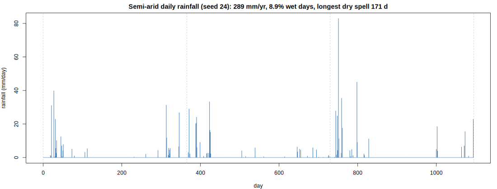
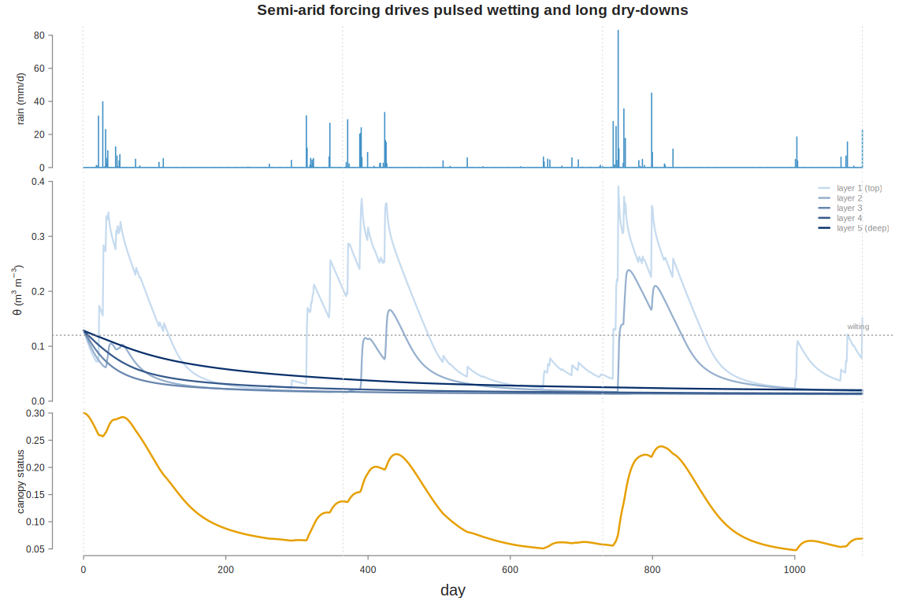
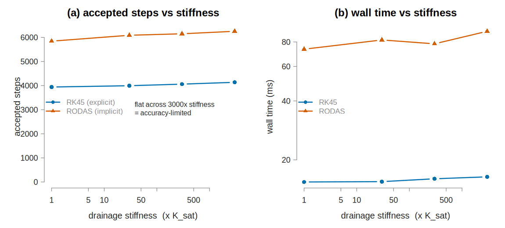
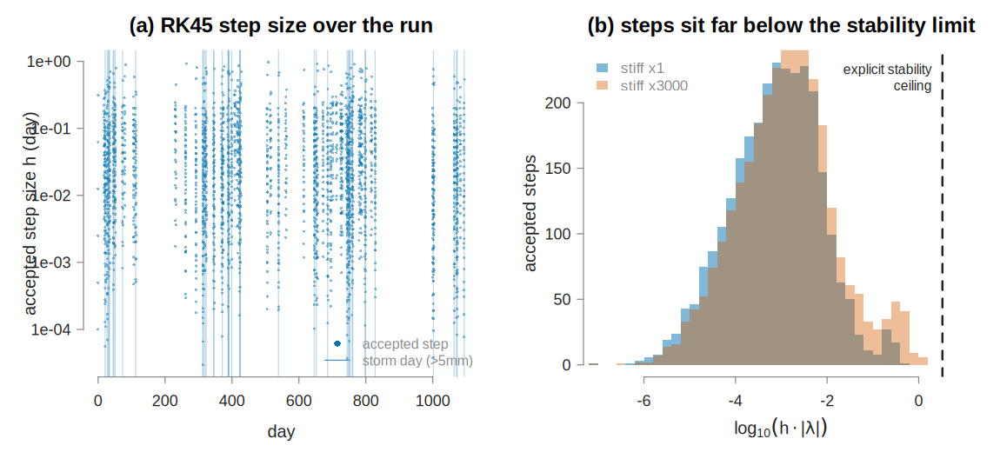
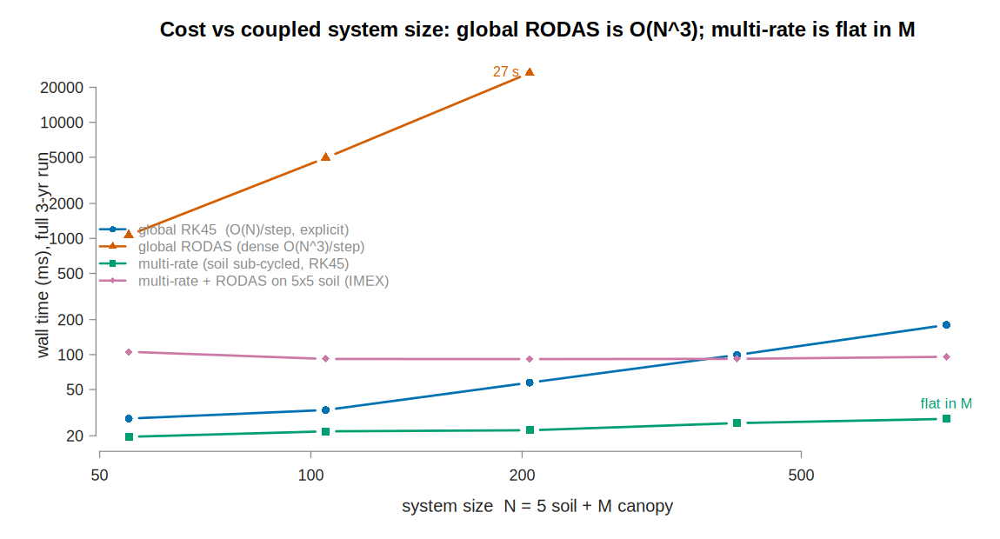

# TF24 soil model: does the new RODAS stepper help, and what is the real problem?

*A numerical-methods study driving the faithful TF24 soil-water model with a realistic
semi-arid Australian rainfall sequence, comparing odelia's explicit RK45 (`rkck`) and the
new implicit RODAS4(3) stepper (`rodas`, odelia #35/#37), diagnosing why the adaptive step
size collapses, and demonstrating that multi-rate sub-cycling — not a global implicit
method — is the fix.*

All code and figures are reproducible from `scripts/tf24-multirate/`. Three independent
integrators (odelia RK45, odelia RODAS, R `deSolve::lsoda`) agree on the model to ~1e-8.

---

## TL;DR

1. **RODAS does not help the TF24 soil block.** Across a **3000× drainage-stiffness sweep**,
   RK45's accepted-step count is essentially **flat** (3941 → 4137) and **100% of steps are
   accuracy-limited** — the step-size × dominant-eigenvalue product `h·|λ|` sits ~10⁻³, three
   to four orders of magnitude below the explicit stability ceiling (~3.3). RODAS takes
   **~1.5× more steps** and is **~5× slower** at every stiffness.
2. **The true problem is accuracy, not stiffness.** The step budget is spent *resolving* rapid
   but genuine features of the solution — storm wetting fronts, the near-residual water-stress
   region, and the daily forcing kinks — not on damping a stiff fast mode. An L-stable implicit
   method can only relax a *stability* limit; here there is none to relax.
3. **Dense RODAS is catastrophic once the soil is coupled to anything.** On a realistic system
   of 5 soil states + M smooth canopy/demographic states, RODAS's forward-AD Jacobian (O(N²))
   and dense LU (O(N³)) make it **~470× slower than RK45 at N=205 (27 s vs 57 ms)** and
   infeasible beyond. This is exactly the localized-stiffness pathology odelia **#38** flags.
4. **Multi-rate sub-cycling matches the problem and wins.** Sub-cycling the 5 soil states while
   advancing the big block once per macro-step makes total cost **nearly independent of M**
   (~20–29 ms for N=55→805), versus RK45's linear growth and RODAS's cubic blow-up —
   **~1200× faster than global RODAS at N=205** — at a controlled splitting-error accuracy.
   Multi-rate can even wrap RODAS on the tiny 5×5 soil block (IMEX) for implicit robustness at
   O(1) cost, should a genuinely stiff regime ever arise.

---

## 1. Background: what RODAS is for (odelia #35–#38)

| Issue | State | Content |
|---|---|---|
| **#35** | open | Proposes RODAS4(3): explicit RK step sizes "collapse to satisfy **stability** constraints rather than accuracy" on stiff systems; RODAS is L-stable, uses the Jacobian, no Newton iteration. |
| **#37** | **merged** (10 Jul 2026) | The implementation. `method = "rodas"`, exact forward-AD Jacobian, dense LU. ~13× fewer steps than RKCK on Van der Pol (ε=1e-4). |
| **#36** | open | AD *through* RODAS (nested `FReal<AReal<double>>` Jacobian). |
| **#38** | open | IMEX / operator-splitting for **large systems with localized stiffness** — dense RODAS is **O(N³)**; soil-water is stiff, demography is not. |

RODAS's entire value proposition is **stability-limited stiffness**. So the first question is
empirical: *is the TF24 soil step collapse actually stability-limited?*

## 2. The model and the forcing

**Soil.** Faithful to `plant/inst/include/plant/models/tf24_environment.h`:
`K(θ)=K_sat·(θ/θ_sat)^(2n_ψ+3)` (drainage, exponent 16.14, → 0 at the dry end),
`ψ(θ)=a_ψ·(θ/θ_sat)^(−n_ψ)/1e6` (matric potential, exponent −6.57, **diverges** at the dry
end), 5 layers, saturation-excess infiltration, a smooth root-uptake stress shut-off near the
residual bound. Physically-consistent units (mm, day): θ_sat=0.428, K_sat=163.04 mm/day,
n_ψ=6.57, θ_res=0.01, depth 1500 mm (dz=300 mm).

**Coupling (the amplifier).** A block of **M** smooth "canopy" states with two-way, low-rank
coupling exactly as the numerical-methods consult frames it: each canopy state tracks a scalar
soil aggregate (`dx_k/dt = α_k·(S̄−x_k)`, `S̄ = mean(θ)/θ_sat`), and the canopy aggregate
`x̄ = mean(x)` modulates soil transpiration demand. System size **N = 5 + M**.

**Forcing.** A reproducible semi-arid daily rainfall sequence (chain-dependent Markov occurrence
+ gamma intensities, summer-dominant; seed 24): **289 mm/yr, 8.9 % wet days, max 83 mm/day, a
171-day drought, 16 storms > 20 mm** over 3 years. Long dry-downs (the near-bound regime)
punctuated by intense pulses (the drainage regime) — both solver stressors in one series.



**Validation.** odelia RK45, odelia RODAS, and `deSolve::lsoda` agree to `max|Δθ| ≈ 1e-8` over
a 120-day window — the model and both steppers are correct.



*Pulsed wetting fronts (top layer spikes toward saturation) and long dry-downs toward the
wilting/residual region; the canopy responds smoothly and slowly — the big block that should be
able to take large steps.*

## 3. Does RODAS help? — No.

Full 3-year horizon, soil-only (M=0), daily kink-split grid, matched tolerance 1e-6, swept over
a drainage-stiffness dial (×K_sat from 1 to 3000; the top of the range corresponds to the
literal-header `dz = 0.3 m` interpretation, ~10⁴ × stiffer relaxation near saturation):

| stiffness | RK45 steps | RK45 wall | RODAS steps | RODAS wall | RODAS/RK45 |
|---:|---:|---:|---:|---:|---:|
| ×1    | 3941 | 15.4 ms | 5845 | 73.5 ms | 1.48× steps, 4.8× wall |
| ×30   | 3996 | 15.5 ms | 6090 | 81.9 ms | 1.52× steps, 5.3× wall |
| ×300  | 4061 | 16.0 ms | 6151 | 78.3 ms | 1.51× steps, 4.9× wall |
| ×3000 | 4137 | 16.4 ms | 6255 | 90.7 ms | 1.51× steps, 5.5× wall |



**RK45's step count barely moves (+5%) while stiffness increases 3000×.** If the collapse were
stability-limited, RK45's steps would grow with stiffness (an explicit method must keep
`h·|λ| ≲ 3.3`). They don't. RODAS — the tool built precisely for stiffness — takes *more* steps
(its embedded 3(4) error estimate is slightly more conservative on these non-smooth features)
and pays ~5× the wall time per the extra Jacobian + LU work.

## 4. The true underlying problem

### 4a. Accuracy, not stability

For every accepted RK45 step, compare the step size `h` to the explicit stability ceiling
`h_stab = 3.3/|λ|`, with `|λ|` the dominant (drainage) Jacobian eigenvalue at that state:

- **100.0 % of substantive steps are accuracy-limited** (`h·|λ| ≤ 1.65`); **0 %** are
  stability-limited — at ×1, ×300, *and* ×3000 stiffness.
- Median `h·|λ| ≈ 8e-4` — the controller runs the step **~3–4 orders of magnitude below** the
  stability boundary. It is bounding **truncation error**, not damping a fast mode.



Why is a stiffer soil *not* more stability-limited? A single fast drainage transient (a layer
draining from saturation) costs only **O(1) explicit steps regardless of |λ|** — a stiffer
layer takes smaller steps but relaxes proportionally faster, so the step *count* through the
transient is invariant. Stability only dominates when a fast mode stays **persistently excited**
over many relaxation times (the Van der Pol limit cycle — where RODAS rightly wins 13×). Pulsed
semi-arid rainfall doesn't do that: it briefly saturates a layer, which then drains once. The
steps are spent **resolving real rapid structure** — the wetting front as a storm infiltrates,
the sharp near-residual water-stress region, and the daily forcing kinks — features that **any
method of comparable order must resolve for accuracy**. RODAS relaxes a constraint that was
never binding. (This independently confirms, with the actual RODAS stepper, the phase-0 /
soil-subsystem consult diagnosis that ruled out an A-stable stepper "by measurement".)

### 4b. The dimension amplifier — where dense RODAS becomes a trap

The soil is 5 states. A real run couples it to a large, smooth block (canopy, demography — the
plant SCM has ~10³ ODEs). Under one global adaptive step size, **the whole N-state system is
advanced at whatever tiny step the 5 soil states demand**, and for an implicit method the
per-step cost is dominated by the block it need not treat implicitly at all:

| N = 5+M | global RK45 | global RODAS | RODAS Jacobian (twin RHS) |
|---:|---:|---:|---:|
| 55  (M=50)  |  28 ms |  1,067 ms | 522 k |
| 105 (M=100) |  33 ms |  4,939 ms | — |
| 205 (M=200) |  57 ms | **26,589 ms** | 1,916 k |
| 805 (M=800) | 180 ms | *(infeasible)* | — |

RODAS's forward-AD Jacobian is **N sweeps/step (O(N²))** and its dense LU is **O(N³)**. At
N=205 it is **~470× slower than RK45 (27 s vs 57 ms)**. This is precisely odelia **#38**: a
global dense implicit method is the wrong structure when stiffness is confined to a tiny
sub-block.

## 5. Multi-rate stepping — the fix that matches the problem

**Scheme.** Give the 5 soil states their own adaptive sub-cycling; advance the big block on a
coarse macro-grid. Within each macro step [t, t+H]: freeze the canopy aggregate `x̄`, integrate
the soil (5 states + one coupling-integral state `J = ∫S̄ dt`) adaptively, then advance the
canopy exactly from the time-averaged aggregate `S̄_avg = ΔJ/H` (the canopy is linear in the
coupling, so `x_k(t+H) = S̄_avg + (x_k−S̄_avg)·e^{−α_k H}`). Cost of the M-block thus decouples
from the soil's step rate.

**Result** (full horizon, matched soil tol 1e-6, macro H = 1 day):

| N = 5+M | global RK45 | global RODAS | **multi-rate** | multi-rate (IMEX: RODAS soil) |
|---:|---:|---:|---:|---:|
| 55  |  28 ms |  1,067 ms | **20 ms** | 106 ms |
| 205 |  57 ms | 26,589 ms | **22 ms** |  91 ms |
| 805 | 180 ms | *(infeasible)* | **28 ms** |  96 ms |



- **Multi-rate wall time is essentially flat in M** (20 → 29 ms across a 15× system-size
  increase): the soil sub-cycle dominates and is independent of M; the canopy adds negligible
  cost. Global RK45 grows linearly; global RODAS grows cubically and dies.
- **~1200× faster than global RODAS at N=205**, and faster than global RK45 too (2.6× at N=205,
  6.4× at N=805).
- **Accuracy** vs a tight global reference: `max|Δ| = 5.6e-4` at H=1, `1.2e-3` at H=2,
  `2.9e-3` at H=5 — the expected O(H) Lie-splitting error, controllable (Strang would be O(H²)).
- **IMEX bonus:** running the soil sub-cycle with RODAS (implicit, on 6 states) is also flat in
  M (~90 ms) — if a genuinely stiff soil regime ever arose, you get implicit robustness on the
  5×5 block **without** the global O(N³) cost.

## 6. Conclusions

- The new RODAS stepper is a valuable addition for genuinely stiff, stability-limited systems
  (Van der Pol, Robertson) — but the **TF24 soil block is not one of them under realistic
  forcing**. Its step collapse is accuracy-limited, so RODAS cannot enlarge the steps and, being
  ~5× more expensive per unit work, is a net loss even soil-only.
- Reaching for a **global** implicit method on the coupled system is actively harmful: dense
  RODAS is O(N³) where only 5 of N states are ever hard.
- The problem the soil block actually poses — a tiny sub-block that demands a small step and
  drags a large smooth system down with it — is a **multi-rate / IMEX** problem (odelia #38).
  Sub-cycling the 5 soil states makes the coupled solve **scale with the soil, not with the
  demography**, at accuracy set by a controllable macro step. That is the lever worth building.

## 7. Reproduce

```
cd scripts/tf24-multirate
Rscript gen_rainfall.R        # -> out/rainfall.csv, fig/rainfall.png
Rscript desolve_check.R       # 3-integrator cross-validation (~1e-8)
Rscript bench_main.R          # stiffness sweep (soil-only)  [Sweep A]
Rscript diagnostic.R          # per-step accuracy-vs-stability classification
Rscript cost_sweep.R          # cost vs N: RK45 / RODAS / multi-rate / IMEX
Rscript figs.R                # all figures
```

## 8. Caveats (honest limitations)

- **Units.** The header leaves rainfall/time dimensionless; the study runs a physically-
  consistent (mm, day) system. The ×1…×3000 stiffness sweep deliberately spans the literal-
  header `dz = 0.3 m` interpretation (~10³ stiffer), and the accuracy-limited verdict holds
  throughout — so it is not an artifact of the unit choice.
- **Multi-rate is a reference demonstration**, not (yet) wired into odelia — that is #38. It
  uses first-order (Lie) splitting with a frozen canopy aggregate; the canopy block is linear in
  the coupling here (the low-rank structure the consult specifies). A nonlinear big block would
  macro-step with its own cheap stepper driven by the summarized coupling — same O(macro × M)
  scaling, same conclusion.
- The severe near-singular collapse (`corr(log Δt, log d) = −0.91`) the consult measured on the
  full plant run arises when the divergent ψ read sits inside the error-controlled coupling;
  this study shows the *mechanism class* (accuracy-limited, RODAS-immune) rather than
  reproducing that exact correlation.
